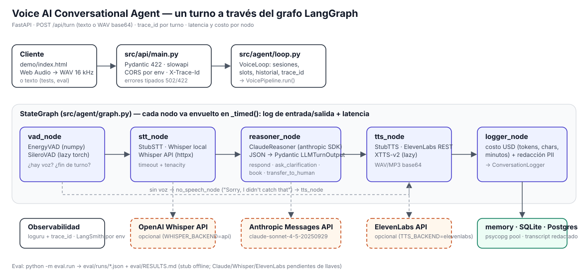

# Voice AI Conversational Agent

[](https://github.com/Juadsuarezsan/voice-ai-agent/actions/workflows/ci.yml)
[](LICENSE)
[](.python-version)
[-brightgreen.svg)](#tests-y-calidad)
[](https://juadsuarezsan.github.io/voice-ai-agent/demo/)

Agente de voz para reservas de restaurante: detecta cuándo el cliente terminó
de hablar, transcribe, decide el siguiente paso con Claude, sintetiza la
respuesta y deja traza de cada turno. **Demo:** https://juadsuarezsan.github.io/voice-ai-agent/demo/
(los casos pre-generados funcionan sin backend; el modo en vivo necesita la API
corriendo, ver [Quickstart](#quickstart)).

## Qué hace este proyecto

Un cliente habla ("quiero una mesa para cuatro mañana a las siete"), el sistema
entiende qué datos faltan, los pregunta uno a uno, lee la reserva para
confirmarla y la cierra, o pasa la llamada a una persona si el cliente lo pide
o si la petición no es una reserva. Cada turno devuelve texto, audio, la acción
tomada, los datos capturados, la latencia de cada etapa y su costo.

## Caso de uso industrial

Recepción telefónica de primera línea: restaurantes, clínicas (agendar citas),
talleres, hoteles. El patrón STT → LLM → TTS con detección de fin de turno es el
que venden Bland AI, Vapi o Retell; aquí está implementado de punta a punta con
componentes intercambiables, evaluación reproducible y sin dependencias
pesadas en la instalación base, para que pueda desplegarse en un contenedor de
300 MB y crecer hacia GPU solo donde haga falta.

## Arquitectura



`POST /api/turn` → `VoiceLoop` (estado de sesión, `trace_id`) → `StateGraph` de
LangGraph con `vad_node → stt_node → reasoner_node → tts_node → logger_node` y
una rama `no_speech_node` cuando el VAD no detecta voz. Detalle en
[docs/architecture.md](docs/architecture.md).

| Etapa | Producción | Alternativa | Sin llaves (CI, demo) |
|---|---|---|---|
| VAD | `silero-vad` (extra `[vad]`) | — | `EnergyVAD` (numpy) |
| STT | `openai-whisper` local (extra `[stt]`) | Whisper API (`whisper-1`) | `StubSTT` |
| Reasoner | Claude `claude-sonnet-4-5-20250929` (SDK `anthropic`, JSON validado, tenacity) | — | `StubReasoner` (regex, solo inglés) |
| TTS | ElevenLabs (REST, httpx) | XTTS-v2 (extra `[tts]`) | `StubTTS` (tono) |
| Persistencia | PostgreSQL (`psycopg` pool) | SQLite | memoria |

## Quickstart

```bash
git clone https://github.com/Juadsuarezsan/voice-ai-agent && cd voice-ai-agent
python3 -m venv .venv && . .venv/bin/activate && pip install -e ".[dev]"
make check            # ruff + black + mypy --strict + pytest --cov (152 tests)
make eval             # python -m eval.run -> eval/runs/*.json + eval/RESULTS.md
make serve            # API en http://localhost:8000 (stubs); demo: python -m http.server -d demo 8080
```

Con llaves: copia `.env.example` a `.env`, pon `ANTHROPIC_API_KEY` (activa
`ClaudeReasoner`), `ELEVENLABS_API_KEY` + `TTS_BACKEND=elevenlabs`, y para STT
`WHISPER_BACKEND=api` con `OPENAI_API_KEY` o `pip install -e ".[stt]"` con
`WHISPER_BACKEND=local`. Docker: `docker compose up` (imagen `base`) o
`VOICE_IMAGE_TARGET=audio docker compose up` (whisper + silero + XTTS, CPU torch);
pendiente de validar con demonio Docker.

Ejemplo de turno:

```bash
curl -s localhost:8000/api/turn -H 'content-type: application/json' \
  -d '{"session_id":"s1","text":"Table for four tomorrow at 7 pm under Ana"}' | jq '{action, slots, latency, usage}'
```

## Métricas y resultados

Tabla generada por `python -m eval.run` (fuente: [eval/RESULTS.md](eval/RESULTS.md),
corrida `eval/runs/2026-09-29-offline-stub.json`). **Todo lo medido proviene del
fallback determinista, sin LLM**; las celdas con llave, GPU o dataset bloqueado
están pendientes y no se estiman.

| Componente | Métrica | Valor |
|---|---|---|
| STT | WER sobre LibriSpeech test-clean | pendiente (openslr.org bloqueado en el entorno; `scripts/wer_benchmark.py --librispeech-dir` listo y probado con fixture) |
| STT | WER en español Common Voice | pendiente (dataset gated) |
| LLM | Resolution rate sobre 100 conversaciones | 90.0 % (90/100) **fallback determinista, sin LLM** · Claude: pendiente (`ANTHROPIC_API_KEY`) |
| TTS | MOS automated | pendiente (NISQA + ElevenLabs / XTTS-v2) |
| Sistema | Latencia p95 end-to-end por turno | 5 ms **solo stubs** · real: pendiente |
| Sistema | Costo por minuto | pendiente (estimación con supuestos en [docs/scalability.md](docs/scalability.md)) |

Baselines y ablaciones (mismo archivo): stub heurístico 90 % (inglés 90/90,
español 0/10); `claude_zero_shot_stateless` y `claude_pipeline` pendientes de
llave; VAD energía vs. apagado: 10/10 silencios rechazados vs. 0/10 (10 llamadas
STT ahorradas); juez heurístico (proxy, no LLM) pass rate 90 %, naturalidad
3.56/5. Rúbrica numerada en `src/eval/judge.py`; análisis de los diez fallos en
[docs/error_analysis.md](docs/error_analysis.md).

## Datos

| Dataset | Uso | Licencia | Estado |
|---|---|---|---|
| `data/eval/conversations.jsonl` (100 conversaciones) | resolution rate | MIT (este repo) | commiteado; **sintético**, generado por `scripts/build_eval_set.py` con semilla fija a partir de frases escritas a mano |
| [LibriSpeech](https://www.openslr.org/12/) test-clean / test-other | WER inglés | CC BY 4.0 | `scripts/download_data.py` (SHA-256 en `data/MANIFEST.txt`); red bloqueada aquí |
| [Common Voice es](https://commonvoice.mozilla.org/es/datasets) | WER español | CC0 (gated) | descarga manual |
| [MultiWOZ 2.4](https://github.com/smartyfh/MultiWOZ2.4) | diálogos reales de referencia | MIT | `scripts/download_data.py` |

Esquema en [docs/data_schema.md](docs/data_schema.md).

## Decisiones técnicas

1. **Whisper local como camino principal y Whisper API como opción medible**: el
   WER exige un modelo controlado; la API queda para la comparativa de costo.
2. **ElevenLabs por REST con httpx**, sin SDK del proveedor: un endpoint, timeout
   y reintentos explícitos, mock con `respx`.
3. **LangGraph `StateGraph`** en vez de un bucle: nodos nombrados, rama
   condicional de VAD, latencia y logs por nodo con un decorador.
4. **VAD por energía por defecto, Silero opcional**: sin torch en la base; Silero
   para streaming real.
5. **Fallback determinista etiquetado, nunca presentado como el sistema**: hace
   posible CI, demo y eval sin llaves; sus límites (solo inglés) se documentan.
6. **Confirmación explícita antes de reservar**: mitiga errores de STT en
   nombres y horas.
7. **JSON del LLM validado con Pydantic y tenacity fuera del SDK**; fallo → 502,
   no degradación silenciosa.

Detalle y alternativas rechazadas en [docs/decisions.md](docs/decisions.md).

## Observabilidad y seguridad

- `trace_id` por turno en todos los logs (loguru) y en la cabecera `X-Trace-Id`;
  cada nodo registra entrada, salida y latencia; `usage.cost_usd` por turno;
  `GET /api/metrics` resume los últimos 100 turnos. LangSmith se activa con
  `LANGSMITH_TRACING=true` + `LANGSMITH_API_KEY` (no ejecutado aquí).
- Validación Pydantic → 422 (entrada vacía, texto o audio sobredimensionado,
  base64 malformado, `session_id` inválido); `slowapi` (`RATE_LIMIT`); CORS
  solo para `CORS_ORIGINS`; PII seudonimizada antes de persistir.
- `gitleaks detect --no-banner --redact` sobre el historial: sin hallazgos con
  `.gitleaks.toml` (un falso positivo documentado: el id público de la voz
  "Rachel" de ElevenLabs). CI ejecuta `gitleaks/gitleaks-action@v2`.

## Tests y calidad

`make check` corre `ruff check .`, `black --check .`, `mypy --strict src/` y
`pytest --cov=src --cov-fail-under=70`. 152 tests, cobertura 97 % (local):
mocks del cliente `anthropic`, `respx` para Whisper API y ElevenLabs, módulos
falsos para `whisper`, `silero_vad`, `torch` y `TTS`, pool falso de psycopg,
casos edge y e2e por la API. CI: [ci.yml](.github/workflows/ci.yml).

## Limitaciones conocidas

- Ninguna métrica con componentes reales está medida todavía: sin llaves de
  Anthropic/ElevenLabs/OpenAI, sin GPU y con openslr/HF bloqueados en el entorno
  de desarrollo. La tabla de resultados lo dice celda por celda.
- El fallback determinista es solo inglés y no entiende correcciones que
  empiezan por "sí, pero…".
- No hay canal telefónico ni WebRTC de producción: el demo usa Web Audio y HTTP
  por turno. No hay RAG sobre una base de conocimiento (la tarea no lo necesita).
- El estado de sesión y el rate limit viven en memoria del proceso: una réplica.
- Las diez conversaciones reales grabadas en MP3 del DoD requieren voz humana y
  TTS real; no existen aún.

## Trabajo futuro

1. Corrida con llaves: `python -m eval.run` con Claude (resolution rate real y
   LLM-as-judge sobre las 100 conversaciones), ElevenLabs y Whisper API; MOS
   con NISQA para ElevenLabs vs XTTS-v2; WER de whisper `tiny`/`base`/`large-v3`
   sobre LibriSpeech y Common Voice es.
2. STT incremental y TTS por chunks para acercarse a <800 ms.
3. Canal LiveKit/Twilio con Silero VAD en streaming.
4. Estado de sesión en Redis y `AsyncConnectionPool` para múltiples réplicas.
5. Diez llamadas reales grabadas como evidencia y publicación de traces en
   LangSmith.

## Estructura

```
src/agent/     reasoner (stub + Claude), vad, graph (LangGraph), loop
src/stt/       StubSTT, LocalWhisperSTT, WhisperAPISTT
src/tts/       StubTTS, ElevenLabsTTS, XTTSLocalTTS
src/storage/   ConversationLogger: memory, SQLite, Postgres
src/security/  redacción de PII
src/eval/      dataset, simulate, judge, baselines, ablation, wer, report
eval/run.py    python -m eval.run  ->  eval/runs/*.json + eval/RESULTS.md
scripts/       build_eval_set, build_demo_cases, wer_benchmark, download_data
demo/          index.html + predictions.json (sin CDN)
docs/          architecture, decisions, scalability, performance, error_analysis, data_schema, blog/
```

## Autor

Juan David Suárez Sánchez · juadsuarezsan@unal.edu.co ·
[LinkedIn](https://www.linkedin.com/in/juan-david-suarez-sanchez-31ab281b7)

Licencia MIT ([LICENSE](LICENSE)).
